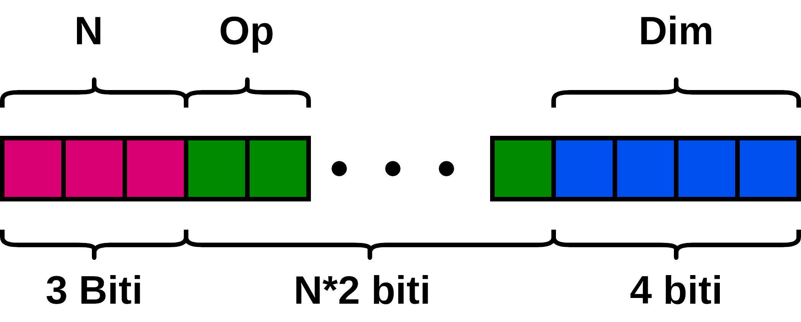

## Microprocesor
În acest proiect se implementează un interpretor de biți similar unui procesor. 
Acesta va avea capacitatea de a decodifică și execută instrucțiuni simple de adunare, scădere, înmulțire și împărțire. 
La nivelul cel mai de bază, informația este stocată sub formă de biți. Pentru un procesor această informație se repartizează în 2 categorii: instrucțiuni și date. 
Practic, dându-se un șir de biți, procesorul decodifică instrucțiunea, iar ulterior o execută.

**Task I**: Se dă o instrucțiune în format zecimal. Folosing operațiile pe biți, o convertim în format binar. O instrucțiune în format binar are următoare structură:

* **N** reprezintă numărul de instrucțiuni ce vor fi executate, reprezentat pe 3 biți, se obține prin convertirea valorii celor mai semnificativi 3 biți din binar în decimal și adunarea cu 1.
* **Op** reprezintă codul unei instrucțiuni și se reprezintă pe 2 biți.
  
| Cod | Operatie |
| --- | -------- |
| 00 | + |
| 01 | - |
| 10 | * |
| 11 | / |

* **Dim** reprezintă dimensiunea unui operand și se reprezintă pe 4 biti, se calculează similar cu N.

**Task II**:
Se bazează pe executarea instrucțiunii, având operanzii și operațiile, trebuie calculat rezultatul folosidu-se totodată, o funcție auxiliară equation() pentru realizarea operațiilor de adunare, scădere, înmulțire și împărțire. Calcularea rezultatului se va face în ordinea primirii operațiilor, nu conform priorității lor.

**Model:**
* Număr: 1410859008
* Instrucțiune: 3 * * + 4
* Numere de introdus: 1
* 54999
* Operanzii: 13 6 13 7
* Rezultat: 1021

**Task III**: Se extinde implementarea de la taskul 2 pentru a execută instrucțiuni ale căror operanzi pot avea orice dimensiune din intervalul [1,16].

**Task IV**: Se implementează precedentă operanzilor, astfel încât operațiile '*' și '/' au precedentă egală între ele, însă precedentă mai mare decât '+' și '-'. 
